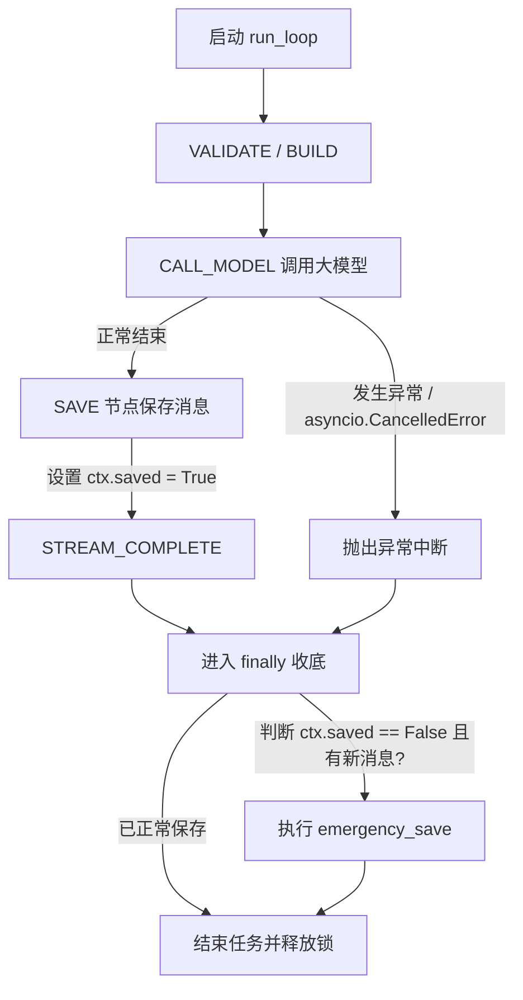

# 后端异常与取消任务时的消息兜底落库文档

本文档记录了对后端聊天状态机（`run_loop`）异常中断、取消（Cancel）任务时，保障已发送消息与部分 AI 响应不丢失的“紧急收底落库”机制。

---

## 1. 背景与问题分析

在 Teachi 的原架构中，聊天回复是一个基于有向图的状态机，其正常生命周期为：
`VALIDATE -> LOAD_HISTORY -> BUILD_MESSAGES -> BUILD_MODEL -> CALL_MODEL -> SAVE -> STREAM_COMPLETE`

* **问题成因**：
  在发送（`SEND`）或重放（`REGENERATE`）阶段，只有当 `CALL_MODEL` 成功完成并正常进入 `SAVE` 节点时，用户的输入消息和大模型的回复才会一起被写入数据库。
  然而，若发生以下情况：
  1. 大模型 API 响应超时或服务报错抛出异常。
  2. 用户在生成过程中点击“停止生成”发出 `STOP` 指令，状态机对应的 asyncio 任务被 `cancel()` 并抛出 `asyncio.CancelledError`。
  
  这会导致 `run_loop` 被异常阻断，**根本无法执行 `SAVE` 节点**。因此，用户刚才发送的那条提问，以及已经生成的局部内容，在重新进入页面时，由于没有写入数据库，就完全消失了。

---

## 2. 解决方案设计：紧急落库（Emergency Save）

为了保证哪怕网络断开或任务被取消，用户的输入和历史留存依然存在，我们在 `backend/loop.py` 中实现了 `finally` 收底落库机制。

### 2.1 引入 `saved` 状态标记
在 `LoopContext` (位于 [context.py](file:///home/seeck/Projects/Teachi/backend/context.py)) 中新增了一个 `saved: bool = False` 标记。
在 `save_node` 正常落库成功后，会将 `ctx.saved` 置为 `True`。

### 2.2 状态机 `finally` 紧急落库
在 `run_loop` (位于 [loop.py](file:///home/seeck/Projects/Teachi/backend/loop.py)) 的整个状态机调度循环外部包裹 `try ... finally`：
* **兜底逻辑**：
  若状态机因为任何原因（任务取消、大模型报错、网络断开等）退出，且当前动作为 `SEND` 或 `REGENERATE`：
  检查 `ctx.saved` 是否为 `False`。若为 `False`，表明这轮新消息尚未被写入数据库。
  如果 `new_messages`（即 `ctx.messages` 相比于 `ctx.history_messages` 的新增消息）不为空：
  * 若为 `REGENERATE` 且有 `anchor_msg_id`，先进行旧版本 bump (`bump_versions_for_anchor`)。
  * 调用 `save_agent_messages` 紧急将新消息（包含用户 prompt，以及 AI 目前已生成的局部回复）写入数据库。
  * 如果有附件（`attachment_ids`），则绑定到产生的 anchor。
  * 将 `ctx.saved` 标记为 `True` 并更新会话时间戳。

---

## 3. 代码修改位置参考

* [context.py](file:///home/seeck/Projects/Teachi/backend/context.py)
  * 为 `LoopContext` 声明新增 `saved: bool = False` 属性。
* [node.py](file:///home/seeck/Projects/Teachi/backend/node.py)
  * 在 `save_node` 节点的末尾落库成功后，添加 `ctx.saved = True`。
* [loop.py](file:///home/seeck/Projects/Teachi/backend/loop.py)
  * 在 `run_loop` 调度中添加 `finally` 块实现紧急落库的全部业务逻辑，确保各种异常路径的消息完整性。

---

## 4. 后端支持倒序分页接口改造

为了支持前端“按需/滚动动态分页加载最近的消息，而不是一次性全量加载”，我们对后端进行了扩展：
1. **DB 门面扩展与死代码清理**：在 `MessagesFacade` ([db.py](file:///home/seeck/Projects/Teachi/backend/db.py)) 中新增了倒序分页查询 `list_latest_by_session_page_for_user` 方法，并将从未被系统调用的冗余死代码 `list_by_session_page_for_user` 与 `list_by_session_page` 彻底清理删除。
2. **API 参数改造**：修改 `/sessions/{sid}/messages` 路由（[data.py](file:///home/seeck/Projects/Teachi/backend/data.py)）使其直接使用查询参数 `limit`（默认 20）和 `offset`（默认 0）进行倒序分页加载，彻底废弃了全量拉取。

